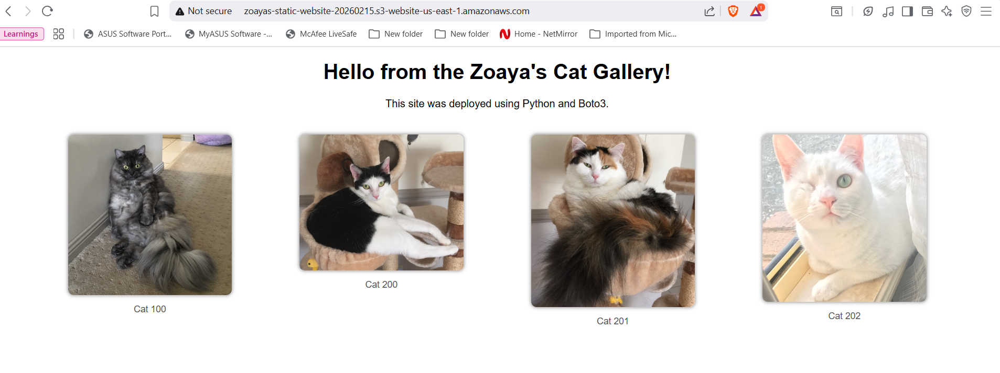
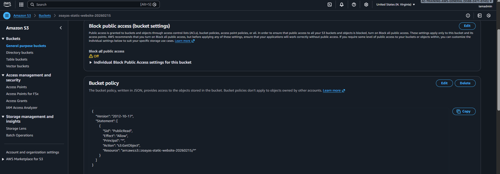

# S3 Static Website Automator

A Python (Boto3) utility to deploy a static HTML website to AWS S3 in seconds.

## Objective
To automate the creation of a public-facing website, handling the complex security configuration (Public Access Block vs. Bucket Policy) and MIME type settings programmatically.

## Tech Stack
- **AWS S3:** Bucket creation, Policy management, Static Hosting configuration.
- **Python Boto3:** Infrastructure as Code logic.

## Key Features
- **Security Automation:** Programmatically disables "Block Public Access" and applies a JSON Bucket Policy.
- **Content Type Handling:** Automatically detects MIME types (HTML, CSS, JPG) so browsers render content correctly.
- **Idempotency:** Designed to update existing sites without crashing.

## Usage
1. Place HTML/Images in `website_files/`.
2. Run `python3 s3_static_site_provisioner.py`.
3. Receive live URL.

## Validation
**Proof of Automation:**

### 1. The Live Website
The Python script successfully uploaded the HTML and assets, configured MIME types, and exposed the public URL.

### 2. The Security Configuration
The script programmaticallly removed "Block Public Access" and applied the JSON Bucket Policy to allow global read access.

